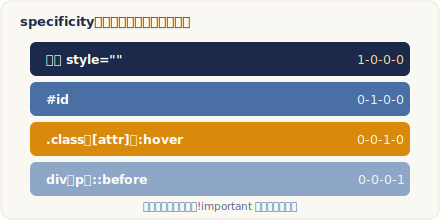

# 串接規則（The Cascade）

> 改寫自 The Odin Project：[The Cascade](https://www.theodinproject.com/lessons/foundations-the-cascade)
> ｜Foundations › CSS Foundations

## 核心概念

{ .od-diagram }

### 為什麼樣式會「不聽話」

寫 CSS 時偶爾會遇到明明想讓某些段落變藍，結果卻跟其他段落一樣是紅色的狀況。這種時候先別急著責怪 CSS，因為 CSS 只會照你寫的規則執行，它不會擅自做決定。真正的原因通常只有三種：瀏覽器的 default styles（預設樣式）、你誤解了某個 property 的行為，或是沒搞懂這一課要講的 the cascade。

所謂 default styles，是瀏覽器內建、你沒寫也會存在的樣式。像 `<button>` 天生就有邊框與底色、標題與段落之間會有空隙，都是預設樣式的功勞。這些預設值各家瀏覽器不完全一樣，所以它們常是「我又沒寫，為什麼會這樣」的元凶之一。

### the cascade 是什麼

CSS 的全名是 Cascading Style Sheets，這個 **Cascading（串接）** 正是重點。當多條規則同時指向同一個元素、而且彼此的 declaration 互相衝突時，the cascade 就是那套決定「最後採用哪一條」的演算法。它會依序考量好幾個因素，這一課聚焦在最常遇到的三個：specificity、inheritance、rule order。

值得先建立的觀念是：the cascade 是**逐個 property 分開判斷**的，而不是「整條規則整包套用或整包捨棄」。同一個元素上，`color` 可能採用甲規則、`background-color` 卻採用乙規則。所以與其想成「哪條規則贏」，更精確的說法是「對每一個 property，哪一條 declaration 勝出」。理解這一點，之後除錯時就不會被搞混。

### specificity：越明確越優先

當同一個元素被多條互相衝突的 declaration 指到時，specificity 會像「比大小」一樣挑出勝者。這一課用到的三種 selector，由高到低是：

1. **ID selector**（例如 `#subsection`）— 最明確。
2. **Class selector**（例如 `.list`）。
3. **Type selector**（也叫 element selector，例如 `div`、`p`）。

規則是：一個 ID selector 永遠打敗任意數量的 class selector；一個 class selector 永遠打敗任意數量的 type selector；而一個 type selector 永遠打敗更低階的選擇器。只有在「最高階的那一類數量打平」時，才會去比同一類 selector 誰用得比較多。

一個更清楚的心智模型是把 specificity 想成三個欄位：`ID - class - type`。ID 記在第一欄、class 記在第二欄、type 記在第三欄。比較時**從左到右一欄一欄比**，左邊欄位有絕對優先權：只要某條規則第一欄比較大，就算它右邊全是零、對手右邊有一堆，它照樣贏。舉例來說，一個 `#id`（1-0-0）會勝過 `.a .b .c .d`（0-4-0），因為第一欄 1 大於 0，後面幾欄根本不用看。第一欄打平才比第二欄，第二欄再打平才比第三欄。

看幾個實際情境。假設 HTML 是 `<div class="main"><div class="list subsection">…</div></div>`：

- `.subsection`（0-1-0）對上 `.main .list`（0-2-0）：兩條都只用 class，但後者用了兩個 class，第二欄 2 大於 1，所以 `.main .list` 勝出。
- 把 `subsection` 改成 `id`，`#subsection`（1-0-0）對上 `.main .list`（0-2-0）：即使後者 class 比較多，前者有 ID，第一欄 1 直接輾壓，`#subsection` 勝。
- `#subsection`（1-0-0）對上 `.main #subsection`（1-1-0）：兩者第一欄都是 1，打平；再比第二欄，後者多了一個 class（1 對 0），所以 `.main #subsection` 勝。

要特別注意：specificity 只決定**互相衝突**的那個 property。如果 `#subsection` 設了 `background-color: yellow`、而勝出的 `.main #subsection` 只設了 `color: red`，那背景色因為沒有對手，仍然會照常套用。specificity 是逐個 property 各自比較的，不是「整條規則整包勝出」。

### 不是每個符號都會加分

比較 selector 時你會看到 universal selector（`*`）以及 combinator（`+`、`~`、`>`，還有代表後代關係的空格）。這些符號**本身不帶任何 specificity**：

- `.class.second-class`（串接，沒有空格）與 `.class .second-class`（空格＝後代 combinator）specificity 完全相同，因為兩者都是兩個 class，空格不加分。
- 同理 `.class > .second-class` 用了 child combinator `>`，但一樣是兩個 class，跟上面打平。
- `*`（0-0-0，毫無 specificity）對上 `h1`（0-0-1，一個 type）時，`h1` 勝，因為 universal selector 的分數是零。

這些 combinator 只是用來描述元素之間的關係，之後的課程會細講，現在只要記得它們不影響 specificity 的計算。

順帶一提，之後你還會遇到別種也會替 specificity 加分的 selector：像 attribute selector（例如 `[type="text"]`）和 pseudo-class（例如 `:hover`、`:focus`）都算在**第二欄**，跟 class 同一級。這一課先掌握 ID、class、type 三欄的骨架即可，日後看到它們時，把它們對號入座到 class 這一欄就好。

### inheritance：某些 property 會傳給後代

inheritance 指的是某些 property 一旦套在某元素上，它的後代（descendants）就算沒被明確寫規則，也會自動繼承同樣的值。**typography 相關的 property**（`color`、`font-size`、`font-family` 等）通常會被繼承，而多數其他 property（如 `margin`、`padding`、`border`、`width`、`background-color`）則不會。

想確認某個 property 到底會不會繼承，可以到 MDN 該 property 的文件、看 **Formal Definition** 區塊裡的 `Inherited` 欄位：例如 `color` 標示為會繼承，`display` 則標示為不會繼承。

有一個重要例外：**直接指定永遠勝過繼承**。看這段：

```css
#parent { color: red; }
.child  { color: blue; }
```

即使 `#parent` 用了 ID、specificity 很高，但那個 red 只是「被 `.child` 繼承而來」的值；而 `.child { color: blue }` 是**直接指向** child 這個元素。只要有任何一條規則直接命中該元素，就會打敗任何從祖先繼承下來的值，所以 child 最後是藍色。繼承只是「沒有更好選項時的備胎」。

### rule order：最後的裁決者

如果前面所有因素都比完了、還是分不出勝負（specificity 一樣、也沒有繼承問題），the cascade 會用最後一招：**後定義的規則勝出**。

```css
.alert   { color: red; }
.warning { color: yellow; }
```

一個同時有 `alert` 與 `warning` 兩個 class 的元素，兩條規則 specificity 相同、也無繼承因素可分高下，於是「誰寫在後面誰贏」，最後套用的是 `.warning` 的 yellow。這也說明了為什麼調整 CSS 檔中規則的先後順序，有時就能改變結果。

### 補充：origin 與 !important

前面三個因素足以應付日常情況，但 the cascade 其實還有更外層的判準：**origin（來源）與 importance（重要性）**，而且它比 specificity 更早被考量。宣告來源由弱到強大致是：瀏覽器預設 → 使用者樣式 → 作者（也就是你寫的）樣式；而加了 `!important` 的宣告會被拉到更高的層級。這代表一條「普通的作者樣式」會勝過「更明確但只是預設值的樣式」。另外，寫在 HTML 元素上的 inline style（`style="…"`）specificity 又比一般 selector 更高。現在先知道有這回事即可，日後會再深入。

### 在瀏覽器裡驗證 the cascade

理論看再多，不如打開瀏覽器的開發者工具（DevTools）親眼看。在頁面上對元素按右鍵選「檢查」，在 Styles 面板裡，你會看到所有指向該元素的規則由上到下排列，而**被蓋掉的 declaration 會被畫上刪除線**。這正是 the cascade 的判決結果視覺化：沒被劃線的就是最終勝出、真正套用的值。當畫面跟你預期不符時，這是最快找出「到底哪條規則贏了、又是被誰蓋掉」的方法，比在腦中乾算 specificity 可靠得多。

## 程式碼範例

下面用一個檔案把三個因素串起來看。先看 HTML：

```html
<!-- index.html -->
<div class="main">
  <div class="list" id="subsection">
    紅字、黃底，內含一個子元素
    <p class="note">我是後代段落</p>
  </div>
</div>
```

再看 CSS，註解標出每條規則的 specificity 三欄值：

```css
/* styles.css */

/* 規則 A：一個 ID  →  1-0-0 */
#subsection {
  background-color: yellow; /* 無人爭奪，照常套用 */
  color: blue;
}

/* 規則 B：一個 ID + 一個 class  →  1-1-0，比 A 更明確 */
.main #subsection {
  color: red; /* 打敗 A 的 blue，文字最終為紅色 */
}

/* 規則 C：一個 class  →  0-1-0，示範繼承與直接指定 */
.note {
  color: green; /* 直接指向 <p>，勝過從父層繼承來的紅色 */
}

/* 規則 D：與 C 同 specificity，靠 rule order 決勝 */
.note {
  color: purple; /* 寫在 C 之後，最終 <p> 為紫色 */
}
```

結果拆解：外層 `#subsection` 的文字是紅色（規則 B 因第二欄較高而勝），背景維持黃色（規則 A 的 `background-color` 沒有對手）；子元素 `<p>` 沒有繼承父層的紅色，而是先被 `.note` 直接指定，再因為規則 D 定義在後，最終顯示紫色。

## 常見陷阱

!!! warning "數量再多的低階 selector 也贏不了一個高階 selector"
    別以為「多疊幾個 class 就能蓋過 ID」。specificity 是一欄一欄比、左欄有絕對優先權：`0-10-0`（十個 class）依然輸給 `1-0-0`（一個 ID）。想提高優先權時，加同一類的 selector 才有用；跨欄硬湊是沒用的。

!!! warning "空格、`>`、`*` 不會提高 specificity"
    後代空格、child combinator `>`、universal selector `*` 都不加分。`.a .b`、`.a > .b`、`.a.b` 三者 specificity 完全相同。看到規則沒生效時，別誤把 combinator 當成「更明確」的證據。

!!! warning "繼承來的值一碰到直接指定就失效"
    父元素就算用 ID 設了 `color`，只要子元素被任何一條規則直接命中（哪怕只是一個 type selector），子元素就採用直接指定的值。繼承的優先權其實非常低，別依賴它去覆蓋子元素上明確寫過的樣式。

!!! warning "改順序會改結果"
    當兩條規則 specificity 相同，純粹是「後者覆蓋前者」。這代表在 CSS 檔裡上下搬動規則、或不小心重複寫了同名 class，都可能悄悄改掉畫面。分不出勝負時，先檢查誰寫在後面。

## 練習

1. 閱讀互動文章 [The CSS Cascade（Amelia Wattenberger）](https://2019.wattenberger.com/blog/css-cascade)，它用可互動的方式帶你看更多影響套用結果的因素（例如 origin、importance、position），把它當成本課的延伸補充。
2. 完成 The Odin Project 的 [css-exercises 練習庫](https://github.com/TheOdinProject/css-exercises) 中 `foundations/cascade` 目錄下的：
   - `01-cascade-fix`

   作法：先讀該練習資料夾裡的 `README` 指示，動手修正 CSS 讓畫面符合要求；卡住或想核對時，可參考同一練習底下 `solution` 資料夾提供的解答。

完成後回頭自問 knowledge check：「一條只用一個 class selector 的規則，跟一條用了三個 type selector 的規則，誰的 specificity 比較高？」答案是**前者**——class（0-1-0）在第二欄有值，type（0-0-3）不管疊幾個都只堆在第三欄，一欄一欄從左比下來，class 勝。

## 原文與延伸資源

- 原文：[The Cascade](https://www.theodinproject.com/lessons/foundations-the-cascade)
- 本課引用：
    - [MDN：Specificity](https://developer.mozilla.org/en-US/docs/Web/CSS/CSS_cascade/Specificity)（三欄權重模型與比較方式）
    - [MDN：Introducing the CSS Cascade](https://developer.mozilla.org/en-US/docs/Web/CSS/CSS_cascade/Cascade)（origin、importance、順序與繼承）
    - [MDN：`color` 的 Formal Definition](https://developer.mozilla.org/en-US/docs/Web/CSS/color#formal_definition)（示範如何查一個 property 是否會繼承）
    - [The CSS Cascade（Amelia Wattenberger）](https://2019.wattenberger.com/blog/css-cascade)（互動式延伸閱讀）

---

> 本講義改寫自 The Odin Project《The Cascade》，原文以 [CC BY-NC-SA 4.0](https://creativecommons.org/licenses/by-nc-sa/4.0/) 授權，本文以相同授權釋出。
