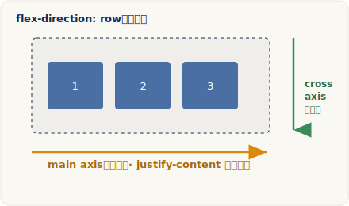

# 主軸與交錯軸（Axes）

> 改寫自 The Odin Project：[Axes](https://www.theodinproject.com/lessons/foundations-axes)
> ｜Foundations › Flexbox

## 核心概念

{ .od-diagram }

Flexbox 最讓人困惑的一點，是它「既能水平運作、也能垂直運作」，而且有些規則會隨著你選的方向而微妙地改變。理解這件事的關鍵，就是搞懂 flex container（flex 容器）裡的兩條軸：main axis（主軸）與 cross axis（交錯軸）。這一課的目標，就是把這兩條軸講清楚，並學會用 `flex-direction` 把內容從「排成一列」改成「疊成一欄」。

### 兩條軸：main axis 與 cross axis

無論你把 flex container 設成哪個方向，它永遠都有兩條互相垂直的軸：

- **main axis（主軸）**：flex item（flex 項目）主要沿著它排列的方向。前面幾課學過的 `flex-grow`、`flex-shrink`、`flex-basis`、`justify-content`，統統都是在操作主軸上的行為。
- **cross axis（交錯軸）**：與主軸垂直的那條軸。之後會學到的 `align-items`，就是在操作交錯軸上的對齊。

這裡最重要的心法是：**這兩條軸的方向，是由 `flex-direction` 決定的，而不是固定的「水平」或「垂直」。** 換句話說，「主軸」不等於「水平」，「交錯軸」也不等於「垂直」；它們誰是水平、誰是垂直，取決於你怎麼設定 `flex-direction`。

### flex-direction：切換軸的方向

`flex-direction` 是套在 flex container 上的屬性，用來決定主軸的走向。它的預設值是 `row`（列），代表主軸是水平的；你也可以把它改成 `column`（欄），讓主軸變成垂直：

```css
.flex-container {
  flex-direction: column;
}
```

在大多數情況下（採用由左至右、由上至下書寫的語言時）：

- `flex-direction: row`（預設）：主軸是**水平**的（由左到右），交錯軸則是**垂直**的（由上到下）。
- `flex-direction: column`：主軸是**垂直**的（由上到下），交錯軸則是**水平**的（由左到右）。

回想我們最早的例子：只在一個 `div` 上加了 `display: flex`，它的子元素就自動水平排開——這其實就是 `flex-direction: row` 這個預設值的效果。如果把它改成 `flex-direction: column`，那些 `div` 就會改成由上往下垂直堆疊。除了 `row` 與 `column`，`flex-direction` 還有 `row-reverse` 與 `column-reverse` 兩個值，效果是把主軸的排列順序反過來，這一課先不深入，只要知道它們存在即可。

### 為什麼改成 column 常常「看起來壞掉」？

`flex-direction: row` 之所以幾乎「開箱即用」、不太需要調整其他 CSS，是因為 block-level element（區塊層級元素）預設就會佔滿父元素的**寬度**——所以在水平主軸上，每個項目本來就有明確的寬度可以分配、伸縮。

但一改成 `column`，複雜度就上來了。block-level element 在垂直方向上，預設高度是**由內容撐出來的**；如果一個 `div` 裡面沒有任何內容，它預設高度就是 `0`。這就導致一個常見的陷阱：明明給了項目 `height`，改成 `column` 後卻整個塌陷、看不見。

罪魁禍首通常是 `flex: 1` 這個簡寫。`flex: 1` 會把 `flex-basis` 展開成 `0`，意思是所有 `flex-grow` 與 `flex-shrink` 的計算都從 `0` 開始起算。空的 `div` 本身高度就是 `0`，於是這些項目「不需要任何高度」也能滿足計算，最後全部塌成一團。

要修正它有幾種方式：

1. 用完整寫法 `flex: 1 1 auto`，讓 `flex-basis` 回到 `auto`，項目就會採用它們被指定的 `height`。
2. 改用 `flex-grow: 1` 這個單一屬性，而不是 `flex` 簡寫（這樣 `flex-basis` 會維持預設的 `auto`）。
3. 直接在父層 `.flex-container` 上指定一個 `height`，讓項目有實際的空間可以撐開。

### 關鍵：flex-basis 指的是「主軸方向」的尺寸

前面反覆提到，`flex-basis` 定義的是「flex item 在**主軸方向**上、還沒開始分配剩餘空間之前的基準尺寸」。這句話的重點在「主軸方向」，因為主軸方向會隨 `flex-direction` 改變，所以 `flex-basis` 到底在控制寬還是高，也會跟著變：

- 在 `flex-direction: row` 的容器裡，主軸是水平的，所以 **`flex-basis` 指的是 width（寬度）**。
- 在 `flex-direction: column` 的容器裡，主軸是垂直的，所以 **`flex-basis` 指的是 height（高度）**。

這正是為什麼 knowledge check 會問「在 `row` 容器與 `column` 容器裡，`flex-basis` 分別指什麼」——答案不同，正是因為 `flex-direction` 改變了主軸的方向，而 `flex-basis` 永遠只作用在主軸上。理解了這條因果鏈，這一課的四個問題其實是同一個概念的不同問法。

### 書寫方向的補充

嚴格來說，`row` 與 `column` 對應到哪個實際方向，還會受到頁面書寫方向影響。若使用由右至左（例如阿拉伯文）或垂直書寫的語言，`row` 的起點與終點會跟著翻轉。這也是為什麼 CSS 官方文件常用 main-start／main-end、cross-start／cross-end 這種「邏輯方向」詞彙，而不是死板的左右上下。不過在你真的要做阿拉伯文或滿文網站之前，暫時不需要為此煩惱，先以「由左至右、由上至下」的直覺理解即可。

## 程式碼範例

下面是一個最小可執行的例子，用來對照 `row` 與 `column` 的差異，以及 `column` 塌陷陷阱的修法。把整段貼進 `.html` 檔即可在瀏覽器打開觀察。

```html
<!DOCTYPE html>
<html lang="zh-Hant">
<head>
  <meta charset="UTF-8" />
  <style>
    .flex-container {
      display: flex;
      /* 預設就是 row（水平主軸）。把下面這行的註解拿掉，
         主軸就變垂直，項目改成由上往下堆疊 */
      /* flex-direction: column; */
      background: #eee;
    }

    .flex-container > div {
      background: peachpuff;
      border: 2px solid tomato;
      height: 100px; /* 在 column 方向時，這個高度會不會生效是重點 */

      /* 關鍵：用完整寫法讓 flex-basis 保持 auto，
         項目才會採用上面指定的 height。
         若改成 flex: 1，flex-basis 會變 0，
         空 div 便會塌陷（在 column 方向特別明顯） */
      flex: 1 1 auto;
    }
  </style>
</head>
<body>
  <div class="flex-container">
    <div></div>
    <div></div>
    <div></div>
  </div>
</body>
</html>
```

觀察重點：

- 保持預設（`row`）時，三個空 `div` 會水平並排，各自佔滿等分的寬度。
- 拿掉 `flex-direction: column;` 的註解後，它們改成垂直堆疊，並各自維持 `100px` 高度。
- 若把 `flex: 1 1 auto;` 改成 `flex: 1;`，在 `column` 方向下這些空 `div` 會塌成一線——因為 `flex-basis` 被展開成 `0`，而空 `div` 內容高度本來就是 `0`。

## 常見陷阱

!!! warning "在 column 方向用 flex: 1 會讓空項目塌陷"
    `flex: 1` 是 `flex: 1 1 0` 的簡寫，它會把 `flex-basis` 設為 `0`，讓所有伸縮計算從 `0` 開始。在 `flex-direction: row` 時，因為 block-level element 預設佔滿父層寬度，通常看不出問題；但一旦切到 `column`，主軸變成垂直，`flex-basis` 改為對應 height，而空 `div` 的內容高度是 `0`，項目就會全部塌陷——即使你明明寫了 `height`。想保留指定的高度，請用 `flex: 1 1 auto`、改用單一的 `flex-grow: 1`，或直接在容器上設 `height`。

!!! warning "別把「主軸」直接記成「水平」"
    主軸與交錯軸的方向是由 `flex-direction` 決定的，不是固定的。`justify-content` 永遠作用在主軸、`align-items` 永遠作用在交錯軸；當你把方向改成 `column`，這兩者「看起來」控制的水平／垂直就對調了。記軸、不要記左右上下，之後學 CSS Grid 也會用到同一套思維。

## 練習

跟著課程的 Assignment 走一遍，把觀念落實到官方文件：

1. 打開 MDN 的 [`flex-direction` 文件](https://developer.mozilla.org/en-US/docs/Web/CSS/flex-direction)，仔細讀過 `row`、`row-reverse`、`column`、`column-reverse` 四個值的說明。
2. 對照文件裡的互動範例，實際切換這四個值，觀察主軸方向與項目排列順序如何改變。
3. 回到上面的程式碼範例，親手試試看：切換 `flex-direction: column`，再把 `flex: 1 1 auto` 換成 `flex: 1`，重現空 `div` 塌陷的現象，然後用三種方法各修一次，確認自己理解成因。

## 原文與延伸資源

- 原文：[Axes](https://www.theodinproject.com/lessons/foundations-axes)
- 本課引用：
  - MDN：[`flex-direction`](https://developer.mozilla.org/en-US/docs/Web/CSS/flex-direction)（Assignment 指定閱讀）
  - MDN：[Basic concepts of flexbox](https://developer.mozilla.org/en-US/docs/Web/CSS/CSS_flexible_box_layout/Basic_concepts_of_flexbox)（main axis／cross axis 與 `flex-basis` 的完整說明）
  - 原文附的 CodePen 互動範例 [flex-direction example](https://codepen.io/TheOdinProjectExamples/pen/BaZKPdw)（互動教學，建議自行操作，不在本文轉述）

---

> 本講義改寫自 The Odin Project《Axes》，原文以 [CC BY-NC-SA 4.0](https://creativecommons.org/licenses/by-nc-sa/4.0/) 授權，本文以相同授權釋出。
