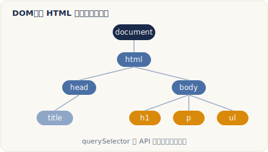

# DOM 操作與事件

> 改寫自 The Odin Project：[DOM Manipulation and Events](https://www.theodinproject.com/lessons/foundations-dom-manipulation-and-events)
> ｜Foundations › JavaScript Basics

## 核心概念

{ .od-diagram }

### 什麼是 DOM？

DOM（Document Object Model，文件物件模型）是瀏覽器把一份網頁內容解析後，在記憶體裡建立的一棵「樹狀結構」。這棵樹由許多 node（節點）組成，節點之間依照它們在 HTML 裡的排列方式，形成親子與兄弟的關係。

以這段 HTML 為例：

```html
<div id="container">
  <div class="display"></div>
  <div class="controls"></div>
</div>
```

`.display` 是 `#container` 的 **child**（子節點），而 `.display` 與 `.controls` 互為 **sibling**（兄弟節點）。就像家族樹一樣：`#container` 是 parent（父節點），底下的兩個 `<div>` 各自佔一條分支。

要特別區分 **node（節點）** 與 **element（元素）** 這兩個詞。node 是廣義的說法，涵蓋文字節點、註解節點、元素節點等各種類型；element 則專指由 HTML 標籤產生的那種節點（例如 `<div>`、`<p>`）。這一課我們幾乎都在操作 element node，因為它才是我們拿來改動畫面的主要對象。

還要記住一個關鍵觀念：**DOM 不等於你的 HTML 檔案**。HTML 只是瀏覽器的「初始設定稿」，一旦被解析成 DOM 之後，我們用 JavaScript 改的是 DOM，而非原始檔。所以畫面會變，但你打開 `.html` 檔內容依然不變。

### 用 selector（選擇器）鎖定節點

要操作某個節點，得先「抓到」它。做法是用 selector，語法和寫 CSS 時完全一樣。針對上面的 `.display`，以下寫法都能命中：

- `div.display`
- `.display`
- `#container > .display`
- `div#container > div.display`

除了 CSS 式選擇器，節點本身還帶有一組 **relational property（關係屬性）**，讓你以「相對位置」找節點，例如 `firstElementChild`（第一個子元素）、`lastElementChild`（最後一個子元素）、`previousElementSibling`（前一個兄弟元素）、`nextElementSibling`（後一個兄弟元素）。

### 常用 DOM method（方法）

節點在 DOM 裡是 JavaScript 物件，身上掛了大量 property 和 method，這些就是我們操作網頁的工具。分成幾類：

**查詢**

- `element.querySelector(selector)`：回傳「第一個」符合條件的元素。
- `element.querySelectorAll(selectors)`：回傳一個 **NodeList**，內含「所有」符合條件的元素。

這裡有個常見誤解：`querySelectorAll` 回傳的**不是** array（陣列）。它長得像陣列、也能用 `forEach` 走訪，但它其實是 NodeList，少了 `map`、`filter`、`reduce` 等許多陣列方法。若真的需要那些方法，可用 `Array.from(nodeList)` 或展開運算子 `[...nodeList]` 把它轉成真正的陣列。

**建立**

- `document.createElement(tagName)`：建立一個新元素。注意它只存在於記憶體，**還沒**放進畫面，這讓你可以先把樣式、class、文字都設定好，再放上去。

**放進 DOM**

- `parentNode.appendChild(childNode)`：把 `childNode` 加成 `parentNode` 的最後一個子節點。
- `parentNode.insertBefore(newNode, referenceNode)`：把 `newNode` 插到 `referenceNode` 之前。

**移除**

- `parentNode.removeChild(child)`：從 DOM 移除 `child`。

**修改元素**

拿到元素的 reference（參照）後，就能改它的樣式、attribute（屬性）、class 與內容。改行內樣式時要注意 kebab-case 的 CSS property（例如 `background-color`）不能直接用點記法，必須改用 camelCase（`div.style.backgroundColor`）或用中括號記法字串形式（`div.style["background-color"]`）。attribute 的設定、讀取與移除各有對應方法：`div.setAttribute("id", "theDiv")` 會在該 attribute 已存在時更新、不存在時新增，`div.getAttribute("id")` 讀出目前的值，`div.removeAttribute("id")` 則把它整個拿掉。class 的增刪改則交給 `classList`：`add`、`remove`、`toggle` 三個方法，比手動拼接行內樣式乾淨得多。

至於填入內容，`textContent` 用來塞純文字，`innerHTML` 則會把字串當成 HTML 解析並渲染。優先用 `textContent`，因為 `innerHTML` 若混入使用者輸入的內容，可能被植入惡意 script，形成 XSS（跨站腳本攻擊）漏洞。

### JavaScript 該放哪裡

DOM 操作方法只有在對應節點「已經存在」時才有效。若把 `<script>` 放在 HTML 最上方，程式會在節點還沒建立前就執行，抓不到任何東西。兩種解法：把 `<script>` 放到 `<body>` 結尾，或放在 `<head>` 但加上 `defer`，讓瀏覽器等 HTML 解析完再執行腳本。

```html
<head>
  <script src="js-file.js" defer></script>
</head>
```

### 事件與監聽器

DOM 操作讓我們「改」網頁，**event（事件）** 則讓改動能「按需觸發」。事件就是網頁上發生的動作，例如滑鼠點擊、按鍵按下。我們用 JavaScript 監聽並回應這些事件。共有三種綁定方式：

1. **HTML 行內屬性**：`<button onclick="alert('Hi')">`。會把 JS 混進 HTML，且一個元素同種事件只能綁一個，不建議。
2. **DOM 的 `on<event>` property**：`btn.onclick = () => {...}`。JS 與 HTML 分開了，但同樣一個元素只能綁一個 handler。
3. **`addEventListener`**：`btn.addEventListener("click", callback)`。這是首選，因為它能為同一事件掛上多個 listener，也保持了關注點分離（separation of concerns）。

傳給 `addEventListener` 的那個函式稱為 **callback（回呼）**，也就是「被當成參數傳進另一個函式」的函式。使用具名函式（named function）當 callback，可讓程式更整潔，也方便在多處重複使用同一段邏輯，甚至日後用 `removeEventListener` 精準移除。

### event 物件、target 與冒泡

callback 可以接一個參數（習慣命名為 `e`），它是瀏覽器自動傳入的 **Event 物件**，裡面藏著這次事件的所有資訊：按了哪個鍵、滑鼠座標，以及最重要的 `e.target`（實際觸發事件的那個 DOM 節點）。

事件在 DOM 樹裡的傳遞分成三個階段：**capturing phase（捕獲階段）** 由最外層往目標節點往下走、**target phase（目標階段）** 命中目標、**bubbling phase（冒泡階段）** 再從目標往上冒回最外層。預設情況下，`addEventListener` 在冒泡階段觸發；若把第三個參數設為 `true`，則改在捕獲階段觸發。

這裡要分清兩個屬性：`e.target` 是「最初觸發事件的節點」，整個傳遞過程都不變；`e.currentTarget`（等同 handler 內的 `this`）則是「目前正在執行 handler 的節點」，會隨冒泡逐層改變。想中止事件繼續往上冒，可呼叫 `e.stopPropagation()`，但別隨意使用，以免擋掉其他區域也需要接收事件的程式。

### 幫一群節點綁監聽器

當你要為多個相似元素綁同樣的 listener，可先用 `querySelectorAll` 取得 NodeList，再用 `forEach` 逐一綁定。更進階的做法是「事件委派（event delegation）」：只在共同的父節點綁一個 listener，利用冒泡在 `e.target` 判斷是誰被點到，就能一次照顧所有子元素，包含之後才動態新增的。

## 程式碼範例

以下是「建立元素並放進畫面」的完整流程。HTML 只提供一個容器：

```html
<body>
  <h1>我的網頁標題</h1>
  <div id="container"></div>
</body>
```

```javascript
// 1. 抓到已存在於 HTML 的 container
const container = document.querySelector("#container");

// 2. 在記憶體建立一個新的 div（此時還沒在畫面上）
const content = document.createElement("div");

// 3. 先把 class 與文字設定好
content.classList.add("content");
content.textContent = "這是一段光榮的文字內容！";

// 4. 最後才放進 DOM，畫面此刻才更新
container.appendChild(content);
```

事件與 event 物件的實際運用：

```javascript
const btn = document.querySelector("#btn");

// 具名函式當 callback，方便重複使用與移除
function paintTarget(e) {
  // e.target 是真正被點到的節點
  e.target.style.background = "blue";
  console.log("你點到的是：", e.target);
}

btn.addEventListener("click", paintTarget);
```

一次綁定多個按鈕：

```javascript
// buttons 是一個 NodeList，可用 forEach 走訪
const buttons = document.querySelectorAll("button");

buttons.forEach((button) => {
  button.addEventListener("click", () => {
    alert(button.id); // 顯示被點按鈕的 id
  });
});
```

## 常見陷阱

!!! warning "在 DOM 建立前就執行腳本"
    若把 `<script>` 放在 HTML 頂端且沒加 `defer`，`querySelector` 會回傳 `null`，因為節點還沒被建立。請把腳本放在 `<body>` 結尾，或在 `<head>` 用 `<script src="..." defer>`。

!!! warning "把 NodeList 當成真陣列"
    `querySelectorAll` 回傳的是 NodeList，不是 array。它有 `forEach`，但沒有 `map`、`filter`、`reduce`。要用這些方法前，先以 `Array.from(nodeList)` 或 `[...nodeList]` 轉成陣列。

!!! warning "濫用 innerHTML 造成 XSS 風險"
    只想放純文字時，請用 `textContent` 而非 `innerHTML`。`innerHTML` 會把字串當 HTML 執行，一旦混入未過濾的使用者輸入，可能被注入惡意 script。

!!! warning "kebab-case 樣式屬性寫錯"
    `div.style.background-color` 會被 JS 解讀成「`background` 減去 `color`」而失敗。請改用 camelCase（`div.style.backgroundColor`）或中括號字串（`div.style["background-color"]`）。

!!! warning "搞混 e.target 與 e.currentTarget"
    `e.target` 永遠是最初被觸發的節點；`e.currentTarget`（即 `this`）是目前執行 handler 的節點。在事件委派時兩者常常不同，別混用。

## 練習

先把上面「建立元素並放進畫面」的範例抄到自己電腦上的檔案：補齊 HTML 骨架，並用 `<script>` 標籤或外部 JS 檔把程式接上，確認畫面正常顯示後再往下做。

接著，**只用 JavaScript 與本課介紹的 DOM 方法**，在 `#container` 裡加入以下元素：

1. 一個紅色文字的 `<p>`，內容為「Hey I'm red!」。
2. 一個藍色文字的 `<h3>`，內容為「I'm a blue h3!」。
3. 一個有黑色邊框、粉紅背景的 `<div>`，並在它裡面再放入：
   - 一個 `<h1>`，內容為「I'm in a div」。
   - 一個 `<p>`，內容為「ME TOO!」。
   - 提示：先用 `createElement` 建好這個 `<div>`，把 `<h1>` 與 `<p>` 用 `appendChild` 放進去之後，最後才把整個 `<div>` 加進 `#container`。

延伸練習：建立三顆按鈕，分別用本課三種綁定方式（行內屬性、`onclick` property、`addEventListener`），點擊時都彈出「Hello World」，親手比較差異。再挑戰用 `querySelectorAll` + `forEach`，讓每顆按鈕被點擊時 `alert` 出自己的 `id`。

## 原文與延伸資源

- 原文：[DOM Manipulation and Events](https://www.theodinproject.com/lessons/foundations-dom-manipulation-and-events)
- 本課引用：
  - [MDN：Introduction to events](https://developer.mozilla.org/en-US/docs/Learn_web_development/Core/Scripting/Events)（事件、event 物件、addEventListener）
  - [javascript.info：Bubbling and capturing](https://javascript.info/bubbling-and-capturing)（事件流三階段、`e.target` 與 `currentTarget`、`stopPropagation`）
  - [MDN：DOM scripting 入門與實作](https://developer.mozilla.org/en-US/docs/Learn_web_development/Core/Scripting/DOM_scripting)（基礎操作與動態購物清單練習）
  - [JavaScript Tutorial：Event delegation](https://www.javascripttutorial.net/javascript-dom/javascript-event-delegation/)（事件委派）
  - [Understanding Callbacks in JavaScript](https://dev.to/i3uckwheat/understanding-callbacks-2o9e)（callback 深入理解）
  - [javascript.info：defer/async 屬性](https://javascript.info/script-async-defer)（腳本載入時機）
  - 影片（未擷取，僅列出）：[Preventing the most common XSS attack](https://youtube.com/watch?v=ns1LX6mEvyM)（`innerHTML` 的安全風險）

---

> 本講義改寫自 The Odin Project《DOM Manipulation and Events》，原文以 [CC BY-NC-SA 4.0](https://creativecommons.org/licenses/by-nc-sa/4.0/) 授權，本文以相同授權釋出。
