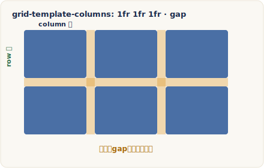

# 建立 Grid

> 改寫自 The Odin Project：[Creating a Grid](https://www.theodinproject.com/lessons/node-path-intermediate-html-and-css-creating-a-grid)
> ｜Full Stack JavaScript › Intermediate HTML and CSS › Grid

## 核心概念

{ .od-diagram }

上一課你已經知道 CSS Grid Layout（格線佈局）大致是什麼，這一課要動手做出自己的第一個 grid。整條路線其實只有四件事：把某個元素變成 grid container（格線容器）、定義欄與列（tracks）、理解 explicit（顯式）與 implicit（隱式）grid 的差別、以及設定格子之間的 gap（間隙）。學會這四件事，你就能用非常少的程式碼掌控版面。

### 把元素變成 grid container

Grid 的心智模型跟 Flexbox 很像：一個 container（容器）包住若干 item（項目）。你只要對某個元素加上 `display: grid`（或 `display: inline-grid`），它就成為 grid container，而它底下的**直接子元素**會自動全部變成 grid item，不需要你一個一個去標記。這正是 Grid 好用的地方。

`grid` 與 `inline-grid` 的差別，跟 `block` 與 `inline-block` 的關係一樣：前者本身是塊級元素、獨佔一整行；後者則能與旁邊的內容並排。內部的格線行為完全相同。

要特別留意「直接子元素」這個限制。只有 container 的第一層子元素才是 grid item，孫元素不算。看下面這段：

```html
<div class="container">
  <div>Item 1</div>
  <div>Item 2
    <p>我不是 grid item！</p>
  </div>
  <div>Item 3</div>
  <div>Item 4</div>
</div>
```

四個 `<div>` 是 grid item，但第二個 `<div>` 裡面那個 `<p>` 是孫層，不會參與這個 grid 的排版。不過就像 Flexbox 一樣，grid item 本身也可以再設 `display: grid` 變成新的 grid container，於是你能做出 grid 裡包 grid 的巢狀結構。

一個剛建立、還沒定義欄列的 grid container 看起來一點都不「格線」——因為若容器和項目都沒有 border（邊框），你根本看不到那些格線。線其實一直都在，只是隱形。想看見它們，可以用瀏覽器開發者工具：Chrome DevTools 會在 grid 元素旁顯示一個 grid 徽章，點下去就會疊上一層 overlay（覆蓋層），把隱形的 lines、tracks、areas 都畫出來（本課練習會帶你操作）。

### 定義欄與列：grid tracks

有了容器與項目，接著要指定欄（column）與列（row）。兩條相鄰格線之間的空間叫做 **track（軌道）**，欄軌道決定欄的寬、列軌道決定列的高。定義它們用兩個屬性：

- `grid-template-columns`：定義欄軌道
- `grid-template-rows`：定義列軌道

這一課我們先用 px（像素）這種固定單位把觀念講清楚，之後的課才會加入百分比與 fr 這種彈性單位。舉例來說，要把四個項目排成 2×2，就給兩欄兩列：

```css
.container {
  display: grid;
  grid-template-columns: 50px 50px; /* 兩欄，各 50px 寬 */
  grid-template-rows: 50px 50px;    /* 兩列，各 50px 高 */
}
```

值裡有幾個數字，就代表有幾條軌道。想加第三欄，就在 `grid-template-columns` 多寫一個值，例如 `50px 50px 50px`。欄與列的值也不必一致，例如 `grid-template-columns: 250px 50px 50px;` 會讓第一欄是其他欄的五倍寬。

Grid 還提供一個簡寫屬性 `grid-template`，讓你一次寫完列與欄。格式是「列在斜線前、欄在斜線後」：

```css
.container {
  display: grid;
  grid-template: 50px 50px / 50px 50px 50px; /* 列 / 欄 */
}
```

上面等同於「兩列各 50px、三欄各 50px」。注意順序是列先欄後，別寫反了。

### explicit grid 與 implicit grid

你用 `grid-template-columns` 與 `grid-template-rows` 明確定義出來的軌道，構成 **explicit grid（顯式格線）**。但如果項目比你定義的格子還多，會發生什麼事？

假設你定義了 2×2（四格），卻放進第五個項目。Grid 不會爆掉，也不會把項目擠出去，而是自動長出一條你沒定義的新軌道（預設往下多一列）來安置它——這就是 **implicit grid（隱式格線）**。當內容超過顯式範圍時，Grid 會自動補上新軌道來自動擺放項目。

關鍵細節：`grid-template-columns` / `grid-template-rows` 設定的尺寸**不會**沿用到這些隱式軌道上。隱式長出的列，預設高度只夠容納內容，往往和你的顯式列不一樣高。想控制它們的尺寸，用這兩個屬性：

- `grid-auto-rows`：設定隱式**列**的高度
- `grid-auto-columns`：設定隱式**欄**的寬度

例如讓自動長出的新列都維持和顯式列一樣的 50px：

```css
.container {
  display: grid;
  grid-template-columns: 50px 50px;
  grid-template-rows: 50px 50px;
  grid-auto-rows: 50px; /* 之後自動長出的列也是 50px */
}
```

預設情況下，Grid 把多出來的內容往下疊、用隱式**列**來容納，也就是垂直方向延伸。比較少見的情況是想讓內容往右水平延伸，這時可以設 `grid-auto-flow: column`，並用 `grid-auto-columns` 定義那些隱式欄的寬度。

### gap：格子之間的間隙

格線的欄與列之間那條空隙，術語叫 gutter（溝槽）或 alley（走道）。你可以分別調整：

- `column-gap`：欄與欄之間的間隙
- `row-gap`：列與列之間的間隙
- `gap`：簡寫，一次設定兩者

`gap` 簡寫的順序是 `row-gap` 在前、`column-gap` 在後；只給一個值時，兩個方向都套用同一個值：

```css
.container {
  gap: 10px;        /* 列間隙與欄間隙都是 10px */
  gap: 20px 10px;   /* 列間隙 20px，欄間隙 10px */
}
```

要留意 gap 只出現在軌道**之間**，格線最外圍不會有它，所以四邊不會多出空白。gap 佔的空間也不能放內容，純粹是視覺上的留白。

把這四塊拼起來——`display: grid` 建立容器、`grid-template-*` 定義軌道、`grid-auto-*` 管理隱式軌道、`gap` 控制間隙——你就掌握了打造基本 grid 所需的全部工具。

## 程式碼範例

以下是一個可直接執行的最小範例：五個項目、2×2 顯式格線，第五個項目由隱式列自動接住，並用 gap 拉開間距。

```html
<!-- index.html -->
<div class="container">
  <div class="item">1</div>
  <div class="item">2</div>
  <div class="item">3</div>
  <div class="item">4</div>
  <div class="item">5</div> <!-- 超出 2x2，會被隱式列接住 -->
</div>
```

```css
/* styles.css */
.container {
  display: grid;
  grid-template-columns: 50px 50px; /* 顯式：兩欄各 50px */
  grid-template-rows: 50px 50px;    /* 顯式：兩列各 50px */
  grid-auto-rows: 50px;             /* 隱式列也保持 50px */
  gap: 10px;                        /* 欄、列間隙皆 10px */
}

.item {
  border: 1px solid #333; /* 加邊框才看得見每個格子的位置 */
  background: #cde;
}
```

前四個項目填滿 2×2，第五個因為沒有對應的顯式格子，Grid 自動長出第三列（高度由 `grid-auto-rows` 指定為 50px）把它放進去。若把 `grid-auto-rows` 拿掉，第三列會塌成只夠容納文字的高度，和上面兩列不一樣高——這就是隱式軌道不繼承顯式尺寸的實際表現。

## 常見陷阱

!!! warning "只有直接子元素會變成 grid item"
    `display: grid` 只作用於容器的第一層子元素。孫元素（例如包在某個 grid item 裡的 `<p>`）不會參與這個 grid。如果想讓更深層的元素也格線化，要把那個中間層元素自己也設成 grid container。

!!! warning "隱式軌道不會沿用顯式軌道的尺寸"
    `grid-template-rows: 50px 50px` 只管你定義的那兩列。內容超出後自動長出的第三列，預設高度只夠塞內容，不會自動變成 50px。要讓新列維持一致高度，必須另外用 `grid-auto-rows`（欄則用 `grid-auto-columns`）。

!!! warning "grid-template 簡寫是「列在前、欄在後」"
    `grid-template: 50px 50px / 50px 50px 50px;` 斜線**前**是列（rows）、**後**是欄（columns），順序和一般直覺的「先欄後列」相反。寫反了版面會整個錯位，出問題時先檢查斜線兩邊。

## 練習

1. 開一個 CodePen 或本機 HTML 檔，放一個 `.container`，裡面塞四個 `<div>` 項目。把容器設成 `display: grid`，用 `grid-template-columns` 與 `grid-template-rows` 排成 2×2，並給項目加上 border 讓格子看得見。
2. 改用簡寫 `grid-template: 50px 50px / 50px 50px 50px;` 重寫一次，感受列在斜線前、欄在斜線後的順序。
3. 加入第五個項目，觀察它被隱式列接住的位置；接著加上 `grid-auto-rows`，讓新列和顯式列一樣高。
4. 用 `column-gap`、`row-gap` 分別調整欄列間隙，再換成簡寫 `gap` 一次設定兩者，比較差異。
5. 閱讀 CSS-Tricks Grid 指南的「Introduction」與「Key Terms」段落，把 container、item、line、track、cell、area 這幾個術語對照本課內容記熟。
6. 打開 Chrome DevTools，在 Elements 面板找到 grid 元素旁的 grid 徽章並點開 overlay；到 Layout 面板勾選顯示 line numbers 與 track sizes，親眼看看隱形的格線。

## 原文與延伸資源

- 原文：[Creating a Grid](https://www.theodinproject.com/lessons/node-path-intermediate-html-and-css-creating-a-grid)
- 本課引用：
    - [MDN：Basic concepts of grid layout](https://developer.mozilla.org/en-US/docs/Web/CSS/CSS_grid_layout/Basic_concepts_of_grid_layout)
    - [CSS-Tricks：A Complete Guide to CSS Grid](https://css-tricks.com/snippets/css/complete-guide-grid/)（閱讀 Introduction 與 Key Terms）
    - [Chrome DevTools：Inspect CSS grid](https://developer.chrome.com/docs/devtools/css/grid/)
    - 延伸影片（選看）：Wes Bos CSS Grid 課程「[implicit vs explicit tracks](https://www.youtube.com/watch?v=8_153Zz4YI8)」

---

> 本講義改寫自 The Odin Project《Creating a Grid》，原文以 [CC BY-NC-SA 4.0](https://creativecommons.org/licenses/by-nc-sa/4.0/) 授權，本文以相同授權釋出。
