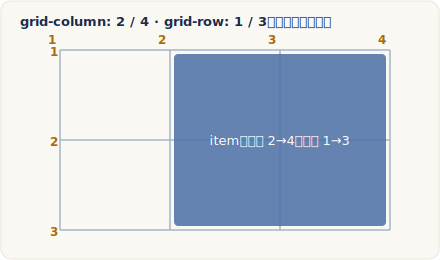

# 定位 Grid 元素

> 改寫自 The Odin Project：[Positioning Grid Elements](https://www.theodinproject.com/lessons/node-path-intermediate-html-and-css-positioning-grid-elements)
> ｜Full Stack JavaScript › Intermediate HTML and CSS › Grid

## 核心概念

{ .od-diagram }

上一課我們用 `grid-template-columns` 與 `grid-template-rows` 把一個容器切成格子。這一課要處理的問題是：**如何叫某個子元素「去坐到第幾格」，甚至「橫跨好幾格」**。要做到這件事，得先把 grid 的三個基本零件講清楚：track（軌道）、line（線）、cell（儲存格）。

### Track、Line、Cell 三個零件

**Track（軌道）** 就是格線系統裡的任一「一整條列」或「一整條欄」。當你寫 `grid-template-columns: 100px 100px 100px` 時，你其實是定義了 3 條直向 track（每條寬 100px）；`grid-template-rows: 100px 100px 100px` 則定義 3 條橫向 track。所以一個 3x3 的格子 = 3 條橫向 track + 3 條直向 track。track 是「一整條」，不是單一格。

**Line（格線）** 是 track 之間的分界線。這裡有個關鍵觀念：**格線是「隱含」（implicitly）產生的，你不能直接建立格線**。只要你定義了 track，介於 track 之間與兩端的格線就自動出現了。格線從 1 開始編號，直向格線由左到右、橫向格線由上到下遞增。因此一個 3x3 的格子，直向格線是 1 到 4（3 條欄需要 4 條界線），橫向格線也是 1 到 4。**定位元素靠的就是這些格線編號**。

順帶一提，瀏覽器開發者工具（Chrome DevTools 的 Layout 面板，勾選 *show line numbers*）除了顯示 1、2、3、4 這種正編號，還會顯示從尾端倒數的**負編號**。負編號提供了另一種定位方式，稍後會用到。

**Cell（儲存格）** 是「一條橫向 track」與「一條直向 track」交會出來的那一小格空間，就像試算表裡由「列、欄」座標決定的一格。**cell 是 grid 上最小的單位**。預設情況下，grid 容器的每個子元素會自動佔據一個 cell。以 3x3 為例，標記為「A」的元素佔的是「橫向第 1 條 track（橫線 1 到 2 之間）× 直向第 1 條 track（直線 1 到 2 之間）」那一格。

一句話總結三者的差異：**line 是「界線」（一條線），track 是「界線之間的一整條列或欄」，cell 是「橫 track 與直 track 交會的最小一格」**。

### 用格線定位：start 與 end

預設每個子元素只佔一格，但我們常常需要讓某個元素「跨好幾格」。做法是明確告訴它「從哪條格線開始、到哪條格線結束」，用這四個屬性：

- `grid-column-start`：從哪條直向格線開始
- `grid-column-end`：到哪條直向格線結束
- `grid-row-start`：從哪條橫向格線開始
- `grid-row-end`：到哪條橫向格線結束

**它們的值就是格線的編號**（記住 knowledge check：`grid-column-start` / `grid-column-end` 收的值是「格線編號」）。舉例：`grid-column-start: 1; grid-column-end: 6;` 表示這個元素在直向上從第 1 條線鋪到第 6 條線，橫跨了 5 條欄。同理 `grid-row-start: 1; grid-row-end: 3;` 讓它在橫向上跨 2 列。這正是把一間小客廳「加大」的方法——用既有的格線去宣告一個元素該橫跨幾列幾欄。

### 三種簡寫：grid-column / grid-row / grid-area

寫四行太囉嗦，CSS 提供了層層簡寫：

**第一層——`grid-column` 與 `grid-row`。** 用一條斜線 `/` 把 start 與 end 合成一行：

```css
grid-column: 1 / 6;  /* 等同 start:1; end:6 */
grid-row: 1 / 3;     /* 等同 start:1; end:3 */
```

**第二層——`grid-area`（四合一）。** 把 row-start / column-start / row-end / column-end 四個值全塞進一行，**順序務必記牢：橫向起 / 直向起 / 橫向終 / 直向終**：

```css
#living-room {
  grid-area: 1 / 1 / 3 / 6;
}
```

### span 關鍵字與負編號

除了寫死終點格線，還有兩個更省心的寫法：

**`span` 關鍵字**——不說「到第幾條線」，改說「跨幾條 track」。`grid-row: 1 / span 3` 意思是「從橫線 1 開始，往下跨 3 列」，效果等同 `grid-row: 1 / 4`，但你不必自己算終點。

**負編號**——從格子尾端倒數。`-1` 代表最後一條格線。最實用的招式是 `grid-column: 1 / -1`，意思是「從第一條線鋪到最後一條線」，也就是**橫跨整個容器寬度**，而且不管容器有幾欄都成立。要注意：負編號只對 `grid-template-columns` / `grid-template-rows` 明確定義出來的 explicit grid（顯式格線）有效。

### grid-area 的另一種身分：命名區域

這裡是最容易搞混的地方：`grid-area` 除了當「四合一的格線簡寫」，還能拿來**替元素取名字**。當 `grid-area` 的值不是數字，而是一個名稱時，它就是在幫這個元素命名：

```css
#living-room {
  grid-area: living-room;  /* 取名，不是定位 */
}
```

替每個元素取好名字後，就能在**容器**上用 `grid-template-areas` 像畫 ASCII 圖那樣，一格一格把整個版面「畫」出來：

```css
.container {
  display: grid;
  grid-template-columns: repeat(5, 1fr);
  grid-template-areas:
    "living living living living kitchen"
    "living living living living bath";
}
```

規則有幾條要記：（1）同一個名字重複出現，該元素就會**跨越**那些格；（2）用一個句點 `.` 代表**空格子**（多個相鄰、中間不留空白的句點算一個空格；要表示多個空格，句點之間須以空白分隔）；（3）**每一列的格子數必須相同**，否則整個 `grid-template-areas` 會失效被忽略；（4）**一個命名區域必須是矩形**，規範不允許 L 形或不連續的區域。

所以 `grid-area` 有兩種完全不同的用法：當數字時是格線定位，當名稱時是命名區域。而「grid area（格區）」這個詞本身，也可以泛指「一群 cell 組成的區塊」——例如客廳佔的那一整塊四方形空間就是一個 grid area，就像公寓裡一個有四面牆的房間。

### auto 與對齊

隨著練習深入，你還會碰到 `auto`（讓瀏覽器自動決定起訖線，也是預設值）以及一整組跟 Flexbox 很像的對齊屬性（`justify-items`、`align-items` 等）。這些之後的課會細講，此處先知道它們存在即可。

## 程式碼範例

下面是一個可直接貼進 `.html` 檔開啟的「公寓平面圖」範例，示範 start/end、簡寫、`span` 與 `1 / -1` 四種定位手法：

```html
<!-- index.html -->
<!DOCTYPE html>
<html lang="zh-Hant">
<head>
<meta charset="UTF-8" />
<style>
  .apartment {
    display: inline-grid;          /* 用 inline-grid 讓容器不撐滿整行，方便觀察 */
    grid-template-columns: repeat(5, 80px);
    grid-template-rows: repeat(4, 80px);
    gap: 4px;
    background: #333;
    padding: 4px;
  }
  .apartment > div {
    display: grid;
    place-items: center;          /* 讓文字置中，純粹為了好看 */
    background: #6ab04c;
    color: #fff;
  }

  /* 客廳：直向第 1 到 6 線（跨 5 欄）、橫向第 1 到 2 線（跨 1 列） */
  #living { grid-column: 1 / 6; grid-row: 1 / 2; }

  /* 廚房：用 grid-area 四合一 → 橫起2 / 直起1 / 橫終4 / 直終2（跨 2 列 1 欄） */
  #kitchen { grid-area: 2 / 1 / 4 / 2; }

  /* 臥室：用 span，從直線 2 出發往右跨 3 欄 */
  #bedroom { grid-column: 2 / span 3; grid-row: 2 / 3; }

  /* 走廊：用負編號從直線 2 一路鋪到最後一條線 */
  #hall { grid-column: 2 / -1; grid-row: 3 / 4; }

  /* 陽台：橫跨整排（1 到 -1） */
  #balcony { grid-column: 1 / -1; grid-row: 4 / 5; background: #eb4d4b; }
</style>
</head>
<body>
  <div class="apartment">
    <div id="living">客廳</div>
    <div id="kitchen">廚房</div>
    <div id="bedroom">臥室</div>
    <div id="hall">走廊</div>
    <div id="balcony">陽台</div>
  </div>
</body>
</html>
```

同一份版面若改用**命名區域**寫，可讀性更高：

```css
/* styles.css：用 grid-template-areas 畫出版面 */
.apartment {
  display: inline-grid;
  grid-template-columns: repeat(5, 80px);
  grid-template-rows: repeat(4, 80px);
  grid-template-areas:
    "living  living  living  living  living"
    "kitchen bedroom bedroom bedroom ."
    "kitchen hall    hall    hall    hall"
    "balcony balcony balcony balcony balcony";
}

#living  { grid-area: living; }
#kitchen { grid-area: kitchen; }
#bedroom { grid-area: bedroom; }
#hall    { grid-area: hall; }
#balcony { grid-area: balcony; }
```

## 常見陷阱

!!! warning "格線編號從 1 開始，而且比欄數多 1"
    N 條欄會產生 N+1 條格線。5 欄的容器，直向格線是 1 到 6，不是 1 到 5。想「鋪滿整排 5 欄」要寫 `grid-column: 1 / 6`（或更保險的 `1 / -1`），寫成 `1 / 5` 只會跨 4 欄。

!!! warning "grid-area 四個值的順序很反直覺"
    `grid-area` 是 `row-start / column-start / row-end / column-end`，也就是「**橫、直、橫、直**」，先橫後直、先起後終。很多人憑直覺寫成「直/橫/直/橫」而排錯位。若容易搞混，寧可拆開寫 `grid-row` 與 `grid-column` 兩行，反而不會錯。

!!! warning "grid-template-areas 每列格子數必須一致，且區域必須是矩形"
    只要有一列的名稱數量跟其他列對不齊，整個 `grid-template-areas` 會被視為無效而**完全忽略**。此外命名區域**只能是矩形**，不能排成 L 形或不連續，否則同樣無效。空格請用句點 `.` 補齊佔位。

!!! warning "負編號只認 explicit grid"
    `-1` 指的是「顯式格線（explicit grid）的最後一條」，也就是你用 `grid-template-columns` / `grid-template-rows` 明確定義出來的範圍。對瀏覽器自動長出來的 implicit grid（隱式格線），負編號不會如你預期地運作。

## 練習

1. 閱讀 MDN 的 [Line-based Placement with CSS Grid](https://developer.mozilla.org/en-US/docs/Web/CSS/CSS_grid_layout/Grid_layout_using_line-based_placement)，把 `grid-column` / `grid-row` / `grid-area` 與 `span`、負編號的用法讀熟。
2. 玩 [CSS Grid Garden](https://cssgridgarden.com/) 的第 1 到 17 關來練習定位元素（後面的關卡超出本課範圍，先不用做）。
3. 完成 The Odin Project 的 CSS 練習題：到 [css-exercises 的 `intermediate-html-css/positioning-grid` 目錄](https://github.com/TheOdinProject/css-exercises/tree/main/intermediate-html-css/positioning-grid)（記得先讀 README 裡的指示），做 `01-basic-holy-grail` 這一題。
   - 提示：這題不要求你背下任何屬性，儘管查 MDN、查 Google、用任何你需要的資源（除了偷看解答）把它做出來。
4. 自我檢查（knowledge check）：試著回答——track 與 line 有何不同？grid 上最小的單位是什麼？`grid-column-start` / `grid-column-end` 收的是什麼值？哪個屬性能把一個元素的所有起訖值合成一行？哪個「容器」屬性能畫出元素的視覺版面結構？

## 原文與延伸資源

- 原文：[Positioning Grid Elements](https://www.theodinproject.com/lessons/node-path-intermediate-html-and-css-positioning-grid-elements)
- 本課引用：
  - MDN — [Grid layout using line-based placement](https://developer.mozilla.org/en-US/docs/Web/CSS/CSS_grid_layout/Grid_layout_using_line-based_placement)
  - MDN — [Grid template areas](https://developer.mozilla.org/en-US/docs/Web/CSS/CSS_grid_layout/Grid_template_areas)
  - 互動練習：[CSS Grid Garden](https://cssgridgarden.com/)（第 1 到 17 關）
  - 練習題原始碼：[TheOdinProject/css-exercises · positioning-grid](https://github.com/TheOdinProject/css-exercises/tree/main/intermediate-html-css/positioning-grid)

---

> 本講義改寫自 The Odin Project《Positioning Grid Elements》，原文以 [CC BY-NC-SA 4.0](https://creativecommons.org/licenses/by-nc-sa/4.0/) 授權，本文以相同授權釋出。
